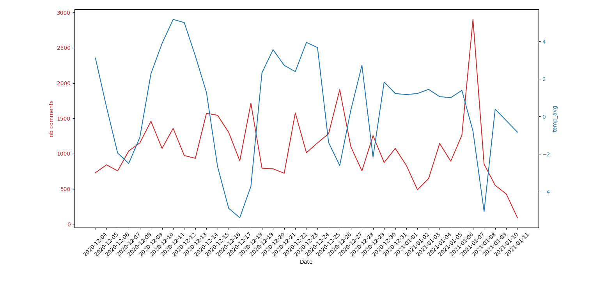
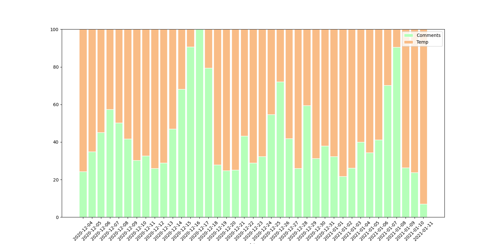

# The Sun : the worst enemy of social networks ?


 

# Context 

## We are data scientists team, in a selling computer components company (B2C). 


However, communications managers have raised their questions about the publication date of certain content, 
which seems to have an impact on the number of views and comments posted. One would almost suspect that computer hardware enthusiasts 
go outside on a sunny day.

Our manager therefore asked you to carry out a study on the impact of weather on the number of returns on company publications.
It is important to be able to repeat this analysis throughout the year.


## Method :

The first step consists to track the recovery of the post tracking level on Reddit. For example, we can focus on the number of votes,
the number of comments, the length of time on the first page, etc...

Then retrieving the meteorological data for the days concerned. According to the communications team, temperatures, risk of rain,
wind strength and other information can be retrieved from many websites, such as [wunderground.com](https://www.wunderground.com/history/daily/ca/toronto/CYTZ/date/2020-1-11)
This correctly retrieved, processed and cleaned data will then have to be linked, in order to highlight the presence of a possible correlation.


# How to use main.py file

## Go to : 

- You can use the "NB_DAYS_TO_FETCH" to choose the amount of day you needed.
- Active debug mode to dowload files and use it in locale, that's enable you to save time between different request. Take Care if you want to use news data you have to delete the previous one first. That's a server protection against an IP ban.

```python
#------------- User settings ------------------------------------------------#
NB_DAYS_TO_FETCH = 90 # Insert the number of day required between ()
weather.COUNTRY_WEATHER = "toronto" # Choise country weather
REDDIT_TARGET_URL = "https://new.reddit.com/r/bapcsalescanada/new/"
DEBUG_MODE_ENABLE = True # To save time, use the local file
EXPORT_CSV_ENABLE = False # Exporte dataframe posts
weather.PATH_GECKO_DRIVER = "PLACE HERE YOUR PATH GECKO DRIVER !"
#-----------------------------------------------------------------------------#
```


## Scraping reddit.com by using BeautifulSoup4

- install the following libraries
```bash
$ pip install BeautifulSoup4
```


## Scraping wunderground.com by using Selenium and BeautifulSoup4

- install the following libraries
```bash
$ pip install Selenium
$ pip install requests
```

- Another thing that needs to be installed for this process is ChromeDriver.
You can find the instructions on installing it on the following [link](https://chromedriver.chromium.org/downloads). 
- You cans also use it with Firefox, but you have to use [Gecko](https://github.com/mozilla/geckodriver/releases)
Download it, install it and place it in a folder that is easily accessible to you.


## Merging the result in one unique .CSV file

- install the following libraries
```bash
$ pip install pandas
```


## Build plots and charts

```bash
$ pip install matplotlib
$ pip install seaborn
```

#  Correlation Graph between temperatures and number of posts in two differente forms (Toronto, 4/12/20 - 13/01/21)




#### Subsequently it will be possible for us to take other data such as wind, rain, atmospheric pressure... 


# Resources

## Useful link :

[BeautifulSoup documentation](https://www.crummy.com/software/BeautifulSoup/bs4/doc/)

[Scrapy documentation](https://scrapy.org/)

[Autoscraper tutorial](https://medium.com/better-programming/introducing-autoscraper-a-smart-fast-and-lightweight-web-scraper-for-python-20987f52c749)

[Weather Data Collection](https://towardsdatascience.com/weather-data-collection-web-scraping-using-python-a4189e7a2ee6)

[Selenium documentation](https://www.selenium.dev/documentation/en/)

[Matplotlib documentation](https://matplotlib.org/)

[Seaborn documentation](https://seaborn.pydata.org/)

[Pandas documentation](https://pandas.pydata.org/docs/)


# ToDo 

- Add other parameters, and suggest other correlations. It is only a sample.

